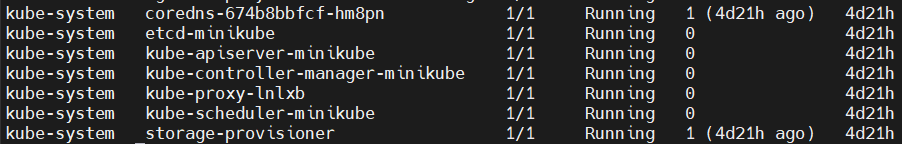

# Домашнее задание к занятию «Kubernetes. Часть 1»

Это задание для самостоятельной отработки навыков и не предполагает обратной связи от преподавателя. Его выполнение не влияет на завершение модуля. Но мы рекомендуем его выполнить, чтобы закрепить полученные знания.

### Задание 1

**Выполните действия:**

1. Запустите Kubernetes локально, используя k3s или minikube на свой выбор.
2. Добейтесь стабильной работы всех системных контейнеров.

## Решение

1. Установка и запуск `minikube` на Astra Linux:\
   1.1. Предварительно необходимо установить `docker`, так как оркестрация контейнеров происходит через него. \
   1.2. Запуск `minikube` необходимо запускать через права обычного пользователя, а не `root`. Для этого нужно добавить его в группу `docker` через команду `usermode -aG docker $USER`\
   1.3. Установка и запуск `minikube`:

```
curl -LO https://storage.googleapis.com/minikube/releases/latest/minikube_latest_amd64.deb
sudo dpkg -i minikube_latest_amd64.deb
minikube start
```
2. Работа системных контейнеров:
> 

---

### Задание 2

Есть файл с деплоем:

```
apiVersion: apps/v1
kind: Deployment
metadata:
  name: redis
spec:
  selector:
    matchLabels:
      app: redis
  replicas: 1
  template:
    metadata:
      labels:
        app: redis
    spec:
      containers:
      - name: master
        image: bitnami/redis
        env:
         - name: REDIS_PASSWORD
           value: password123
        ports:
        - containerPort: 6379
```


**Выполните действия:**

1. Измените файл с учётом условий:

 * redis должен запускаться без пароля;
 * создайте Service, который будет направлять трафик на этот Deployment;
 * версия образа redis должна быть зафиксирована на 6.0.13.

2. Запустите Deployment в своём кластере и добейтесь его стабильной работы.

## Решение

Изменённый `deploy` с нужными изменениями:
```
apiVersion: apps/v1
kind: Deployment
metadata:
  name: redis
spec:
  selector:
    matchLabels:
      app: redis
  replicas: 1
  template:
    metadata:
      labels:
        app: redis
    spec:
      containers:
      - name: master
        image: bitnami/redis:6.0.13
        env:
          - name: ALLOW_EMPTY_PASSWORD
            value: "yes"
        ports:
        - containerPort: 6379
---
apiVersion: v1
kind: Service
metadata:
  name: redis
spec:
  selector:
    app: redis
  ports:
    - protocol: TCP
      port: 6379
      targetPort: 6379

```

Вывод развёрнутого контейнера с `redis`:

```
gis@astra:~$ kubectl get po
NAME                     READY   STATUS    RESTARTS   AGE
redis-54457d549d-tks6k   1/1     Running   0          61s
gis@astra:~$ kubectl logs redis-54457d549d-tks6k
redis 10:38:22.93
redis 10:38:22.93 Welcome to the Bitnami redis container
redis 10:38:22.94 Subscribe to project updates by watching https://github.com/bitnami/bitnami-docker-redis
redis 10:38:22.94 Submit issues and feature requests at https://github.com/bitnami/bitnami-docker-redis/issues
redis 10:38:22.94
redis 10:38:22.94 INFO  ==> ** Starting Redis setup **
redis 10:38:22.96 WARN  ==> You set the environment variable ALLOW_EMPTY_PASSWORD=yes. For safety reasons, do not use this flag in a production environment.
redis 10:38:22.97 INFO  ==> Initializing Redis
redis 10:38:23.00 INFO  ==> Setting Redis config file
redis 10:38:23.05 INFO  ==> ** Redis setup finished! **

redis 10:38:23.08 INFO  ==> ** Starting Redis **
1:C 20 Aug 2025 10:38:23.121 # oO0OoO0OoO0Oo Redis is starting oO0OoO0OoO0Oo
1:C 20 Aug 2025 10:38:23.121 # Redis version=6.0.13, bits=64, commit=00000000, modified=0, pid=1, just started
1:C 20 Aug 2025 10:38:23.121 # Configuration loaded
                _._
           _.-``__ ''-._
      _.-``    `.  `_.  ''-._           Redis 6.0.13 (00000000/0) 64 bit
  .-`` .-```.  ```\/    _.,_ ''-._
 (    '      ,       .-`  | `,    )     Running in standalone mode
 |`-._`-...-` __...-.``-._|'` _.-'|     Port: 6379
 |    `-._   `._    /     _.-'    |     PID: 1
  `-._    `-._  `-./  _.-'    _.-'
 |`-._`-._    `-.__.-'    _.-'_.-'|
 |    `-._`-._        _.-'_.-'    |           http://redis.io
  `-._    `-._`-.__.-'_.-'    _.-'
 |`-._`-._    `-.__.-'    _.-'_.-'|
 |    `-._`-._        _.-'_.-'    |
  `-._    `-._`-.__.-'_.-'    _.-'
      `-._    `-.__.-'    _.-'
          `-._        _.-'
              `-.__.-'

1:M 20 Aug 2025 10:38:23.123 # Server initialized
1:M 20 Aug 2025 10:38:23.123 * Ready to accept connections

```


---

### Задание 3

**Выполните действия:**

1. Напишите команды kubectl для контейнера из предыдущего задания:

 - выполнения команды ps aux внутри контейнера;
 - просмотра логов контейнера за последние 5 минут;
 - удаления контейнера;
 - проброса порта локальной машины в контейнер для отладки.

## Решение

1. `kubectl exec -it redis-54457d549d-tks6k -- ps aux`
2. `kubectl logs -l app=redis --since=5m`
3. `kubectl delete po -l app=redis` и для полного удаления `kubectl delete -f <название_файла.yaml>`
4. `kubectl port-forward -l app=redis 6379:6379`

---

### Задание 4

Есть конфигурация nginx:

```
location / {
    add_header Content-Type text/plain;
    return 200 'Hello from k8s';
}
```

**Выполните действия:**

Напишите yaml-файлы для развёртки nginx, в которых будут присутствовать:

 - ConfigMap с конфигом nginx;
 - Deployment, который бы подключал этот configmap;
 - Ingress, который будет направлять запросы по префиксу /test на наш сервис.

## Решение

